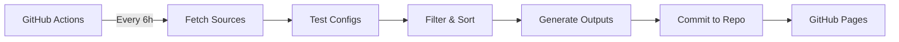

# ConfigStream

🚀 **Automated Free VPN Configuration Aggregator**

[](https://github.com/AmirrezaFarnamTaheri/ConfigStream/actions/workflows/merge.yml)
[](https://www.gnu.org/licenses/gpl-3.0)

ConfigStream automatically collects, tests, and publishes working VPN configurations from free public sources. All configurations are automatically updated every 6 hours via GitHub Actions.

## 🌐 Get Fresh Configurations

Visit our GitHub Pages site to download the latest tested configurations:

### **👉 [https://amirrezafarnamtaheri.github.io/ConfigStream/](https://amirrezafarnamtaheri.github.io/ConfigStream/)**

## 📥 Available Formats

- **Base64 Subscription** - Universal format compatible with V2RayNG, V2Box, and similar clients
- **Clash YAML** - Ready-to-use configuration for Clash and Clash Meta
- **Raw Configs** - Plain text configuration links

## ✨ Features

- ✅ **Automatic Updates** - Fresh configurations every 6 hours
- ✅ **Performance Testing** - All configs tested before publishing
- ✅ **Multiple Formats** - Support for various VPN clients
- ✅ **Latency Sorting** - Configs sorted by performance
- ✅ **Open Source** - Fully transparent and auditable
- ✅ **Zero Setup** - Just grab the subscription link and go

## 🔧 How It Works



1. **GitHub Actions** triggers every 6 hours
2. **Fetches** VPN configurations from multiple public sources
3. **Tests** each configuration for connectivity and latency
4. **Filters** out non-working configs
5. **Sorts** by performance (ping time)
6. **Generates** multiple output formats
7. **Commits** to repository automatically
8. **Publishes** via GitHub Pages

## ⚠️ Security Disclaimer

**IMPORTANT:** These are free public VPN nodes from unknown operators.

- ❌ **NOT for banking** or sensitive activities
- ❌ **Traffic may be logged** or modified
- ❌ **No privacy guarantees**
- ✅ **Good for casual browsing** and bypassing geo-restrictions
- ✅ **Use HTTPS** websites when possible

**Use at your own risk. Read our [full disclaimer](docs/tutorial.md#-important-security--privacy-disclaimer).**

## 💻 Local Development

### Prerequisites

- Python 3.8 or higher
- pip

### Installation

```bash
# Clone the repository
git clone https://github.com/AmirrezaFarnamTaheri/ConfigStream.git
cd ConfigStream

# Install in development mode
pip install -e .
```

### Usage

The primary command for local use is `merge`, which runs the entire pipeline.

```bash
# Run the full fetch, test, and generate pipeline
configstream merge --sources sources.txt --output output/
```

This will:
1.  Read the list of URLs from `sources.txt`.
2.  Fetch all configurations from those URLs.
3.  Test each configuration for connectivity and latency.
4.  Generate `vpn_subscription_base64.txt`, `clash.yaml`, and `configs_raw.txt` in the `output/` directory.

## 📁 Project Structure

```
ConfigStream/
├── .github/
│   └── workflows/
│       └── merge.yml          # Automated GitHub Actions workflow
├── src/
│   └── configstream/
│       ├── cli.py             # Command-line interface logic
│       ├── core.py            # Core parsing and testing logic
│       └── pipeline.py        # Main application pipeline
├── tests/                     # Test suite
├── output/                    # Generated configs (auto-updated by workflow)
├── sources.txt                # List of source URLs for the workflow
├── index.html                 # GitHub Pages landing page
└── README.md
```

## 🧪 Testing

```bash
# Run all tests
pytest

# Run with coverage report
pytest --cov=configstream
```

## 📊 Supported Protocols

- ✅ VMess
- ✅ VLESS
- ✅ Shadowsocks (SS)
- ✅ Trojan

All protocols are fully tested for connectivity and latency.

## ✨ New Features

- **Trojan Protocol Support:** We now support the Trojan protocol, in addition to VMess, VLess, and Shadowsocks.
- **Security Testing:** We've implemented a security test to identify and filter out malicious nodes.
- **Country Filtering:** You can now filter proxies by country using the `--country` option in the `merge` command.

## 🤝 Contributing

Contributions are welcome! Please:

1. Fork the repository
2. Create a feature branch (`git checkout -b feature/amazing-feature`)
3. Commit your changes (`git commit -m 'Add amazing feature'`)
4. Push to the branch (`git push origin feature/amazing-feature`)
5. Open a Pull Request

## 📝 License

This project is licensed under the GNU General Public License v3.0 - see the [LICENSE](LICENSE) file for details.

## 🙏 Acknowledgments

- Thanks to all free VPN providers
- Built with Python and GitHub Actions
- Powered by the open-source community

## 📞 Support

- 🐛 [Report a Bug](https://github.com/AmirrezaFarnamTaheri/ConfigStream/issues)
- 💡 [Request a Feature](https://github.com/AmirrezaFarnamTaheri/ConfigStream/issues)
- ⭐ Star this repo if you find it useful!

---

**Made with ❤️ for internet freedom** | **Educational purposes only**