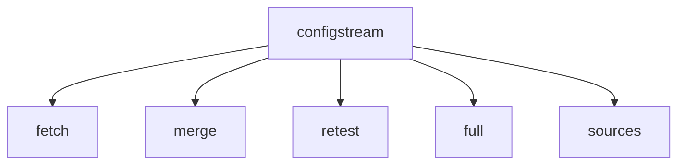

# ConfigStream

A toolchain for collecting, testing, and merging free VPN configuration links from public sources, now with a modern web interface.

[](https://github.com/AmirrezaFarnamTaheri/ConfigStream/actions/workflows/ci.yml)
[](https://www.gnu.org/licenses/gpl-3.0)

This project provides a command-line tool and a web interface to automatically fetch VPN configurations from public sources, test their connectivity, and merge them into a single, performance-sorted subscription link.

The `configstream` command provides several subcommands for power users:


**Security Note**: All VPN servers collected by this tool come from public lists. Operators are unknown and may log or even alter your traffic. Avoid using them for banking or other sensitive tasks. See the [Important Security & Privacy Disclaimer](docs/tutorial.md#-important-security--privacy-disclaimer) for best practices.

- These nodes come from public sources with unknown operators.
- Avoid using them for banking or sensitive work.
- Traffic may be logged or modified.
- Best for casual browsing or bypassing blocks, not as a secure VPN.
- Use at your own risk.

**Best practice reminders:**
- Don't sign into critical accounts.
- Prefer HTTPS connections.
- Use temporary or secondary credentials when possible.

> **Note**: The default protocol list is optimised for the Hiddify client. Other VPN apps may require adjusting `--include-protocols`.

## Table of Contents

- [Features](#features)
- [Quick Start](#-quick-start)
- [Modern Web Interface](#modern-web-interface)
- [Full Tutorial](docs/tutorial.md)
- [Protocol Details](docs/protocol-deep-dive.md)
- [Troubleshooting](docs/advanced-troubleshooting.md)
- [Source List](#source-list)
- [Output Files](#output-files)
- [FAQ](#faq)

## Features

- **Modern Web Interface:** A user-friendly dashboard to monitor, manage, and test your proxy configurations.
- **Automated Fetching:** Gathers VPN configurations from web sources and Telegram channels.
- **Wide Protocol Support:** Parses a variety of protocols, including VMess, VLESS, Trojan, and Shadowsocks.
- **Comprehensive Testing:** Tests the connectivity and latency of each server.
- **Advanced Filtering:** Filters configurations by protocol, country, or regex patterns.
- **Performance Ranking:** Ranks the merged configurations by latency or reliability.
- **Multiple Export Formats:** Generates subscription files for various clients, including raw text, base64, Clash, and Sing-Box.
- **Powerful CLI:** Provides a command-line interface for all fetching, merging, and testing operations.
- **Automation-Ready:** Can be automated for periodic runs using the included Docker Compose setup.

### ⚡ Quick Start

**Legal Notice**: This software is provided for educational purposes only. You are responsible for complying with all local regulations when using any collected VPN nodes.

1.  **Install Python 3.8 or newer**
    -   On **Windows** download it from [python.org](https://www.python.org/downloads/) and tick *Add Python to PATH* during setup.
    -   On **macOS/Linux** use your package manager, e.g. `sudo apt install python3`.

2.  **Clone the repository**
    ```bash
    git clone https://github.com/AmirrezaFarnamTaheri/ConfigStream.git
    cd ConfigStream
    ```

3.  **Install the package and its dependencies**
    ```bash
    # Install the core package and CLI
    pip install .
    # For development (tests, linters), install the [dev] extras
    pip install -e .[dev]
    # To run the web interface, install the [web] extras
    pip install -e .[web]
    ```
    *To filter by country, also install `geoip2` and download the free GeoLite2 database from MaxMind.*

4.  **Copy and customize `config.yaml`**
    After installing the requirements, copy `config.yaml.example` to `config.yaml`. Edit this file to set proxy settings or tweak other options as needed.

5.  **Start the Web Interface (Recommended)**
    ```bash
    python -m configstream.web_dashboard
    ```
    Access the dashboard in your browser at `http://localhost:8080` to monitor and manage proxies visually.

6.  **Gather configuration links (CLI)**
    ```bash
    configstream fetch --hours 12
    ```
    This creates `output/vpn_subscription_raw.txt` and other files based on your configuration.

7.  **Merge and sort the results (CLI)**
    ```bash
    configstream merge
    ```

8.  **All in one step (CLI)**
    ```bash
    configstream full --hours 12
    ```
    This runs the fetch and merge commands sequentially.

> **Need more options?** Run `configstream --help` or `configstream <command> --help` for the full list of options.

### Modern Web Interface

ConfigStream includes a modern, user-friendly web interface for monitoring and managing your proxy configurations.

**To run the web interface:**
1.  Install the web dependencies: `pip install -e .[web]`
2.  Start the server:
    ```bash
    python -m configstream.web_dashboard
    ```
3.  Access the dashboard at `http://localhost:8080`.

The interface provides a seamless experience for interacting with the core features of the toolchain.

**Available Pages:**

-   **Dashboard:** A comprehensive overview of your proxy network, featuring key statistics like total sources, active proxies, success rates, and average ping. It also includes a preview of the most reliable recent proxy tests.
-   **Sources:** View and manage your list of configuration sources.
-   **History:** A detailed table of all tested proxies, their reliability, test counts, and last-tested timestamps.
-   **Analytics:** (Placeholder) This page will feature advanced data visualizations and analytics on proxy performance.
-   **Testing:** A manual testing ground to paste and test proxy configurations on the fly.
-   **Scheduler:** Monitor and manage scheduled jobs for fetching and testing proxies.
-   **Settings:** View the current application configuration derived from `config.yaml`.
-   **Help:** (Placeholder) This page will offer detailed guides and documentation.
-   **API Docs:** (Placeholder) This page will provide comprehensive documentation for the ConfigStream API.

### Managing Sources

The `sources` command provides a simple way to manage the `sources.txt` file from the command line.

- **List all sources**: `configstream sources list`
- **Add a new source**: `configstream sources add "http://example.com/new-source"`
- **Remove a source**: `configstream sources remove "http://example.com/new-source"`

### Output Files

| File Name                              | Purpose                                                                                                  |
| -------------------------------------- | -------------------------------------------------------------------------------------------------------- |
| `vpn_subscription_base64.txt` | *(optional)* A base64-encoded file for direct import from a URL.                  |
| `vpn_subscription_raw.txt`    | A plain text list of all the VPN configuration links.                                                    |
| `vpn_detailed.csv`            | *(optional)* A spreadsheet with detailed info about each server. |
| `vpn_report.json`             | A report with all stats and configurations in JSON format.                      |
| `vpn_report.html`             | *(optional)* An HTML table summarizing the results.                           |
| `vpn_singbox.json`            | Outbound objects ready for import into sing-box/Stash.                                                   |
| `clash.yaml`                  | A Clash configuration with all proxies and a basic group.                  |

### FAQ

### Why does the script take so long?
The merger checks hundreds of servers. Reduce the number of sources or use a smaller `--concurrent-limit`. Skipping tests with `--no-url-test` on the `merge` command can also speed up runs.

### There is no output directory
Ensure you ran the script in this repository and watch for errors. Results are saved in the `output/` folder or the location given by `--output-dir`.

### Telegram authentication errors
Verify your `telegram_api_id`, `telegram_api_hash` and bot token.

### GeoIP lookup errors
Install the `geoip2` package and download the free GeoLite2 database from MaxMind. Pass `--geoip-db /path/to/GeoLite2-Country.mmdb` to enable country filtering.

## Testing

Run the tests with `pytest`.

> **Important**: install the development extras with `pip install -e .[dev]` **before** running the tests.

Then execute:
```bash
python -m pytest
```

## Changelog & Contributing

See [CHANGELOG.md](CHANGELOG.md) for a summary of new features and updates.
If you encounter problems or have improvements, please open an issue or submit a pull request. For detailed contribution guidelines see [CONTRIBUTING.md](CONTRIBUTING.md).

## License

ConfigStream is licensed under the GNU General Public License v3.0. See the [LICENSE](LICENSE) file for details.