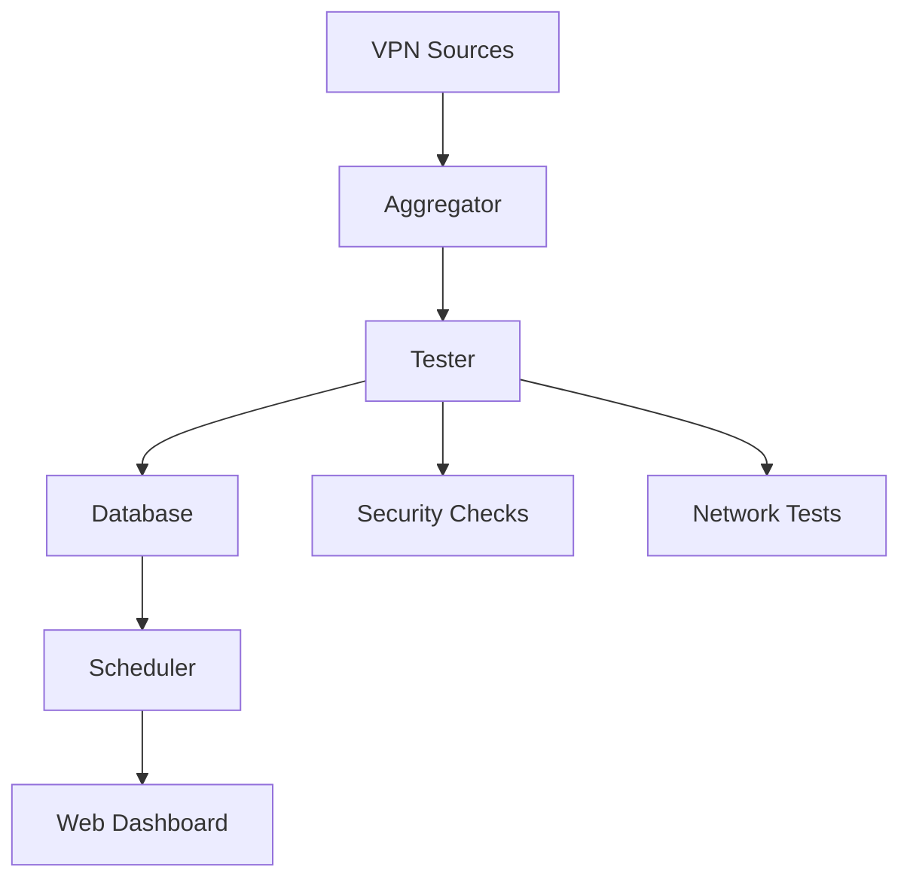

# Architecture

ConfigStream is designed as a modular pipeline for processing VPN configurations. The following diagram illustrates the high-level architecture of the system:

## Components

### VPN Sources
The pipeline begins with a list of VPN sources, which can be either a local file or a remote URL. These sources contain a list of VPN configurations in various formats.

### Aggregator
The Aggregator is responsible for fetching the VPN configurations from the sources. It can handle multiple sources and protocols, and it deduplicates the configurations to ensure that each one is processed only once.

### Tester
The Tester is the core of the system. It takes the aggregated configurations and subjects them to a series of tests to determine their quality. These tests include:
*   **Connectivity:** Checks if the server is online and reachable.
*   **Latency:** Measures the round-trip time to the server.
*   **GeoIP Lookup:** Determines the country and ISP of the server.

### Security Checks
The Tester also performs a series of security checks to identify potentially malicious or compromised servers. These checks include:
*   **IP Reputation:** Checks the IP address against a list of known malicious IPs.
*   **Certificate Validation:** Verifies the SSL/TLS certificate of the server.
*   **Tor/Proxy Detection:** Detects if the server is a Tor exit node or a public proxy.
*   **Blocklist Checking:** Checks the server against a list of known blocklists.

### Network Tests
In addition to the basic connectivity and security tests, the Tester can also perform a series of more advanced network tests to determine the quality of the connection. These tests include:
*   **Bandwidth Measurement:** Measures the download and upload speed of the connection.
*   **Packet Loss and Jitter Analysis:** Measures the packet loss and jitter of the connection.

### Database
The results of the tests are stored in a database. This allows for historical performance tracking and reliability scoring.

### Scheduler
The Scheduler is responsible for running the test cycles automatically at a configurable interval.

### Web Dashboard
The Web Dashboard provides a real-time view of the system. It displays the latest test results, statistics, and historical performance data. It also allows the user to manage the system and its settings.