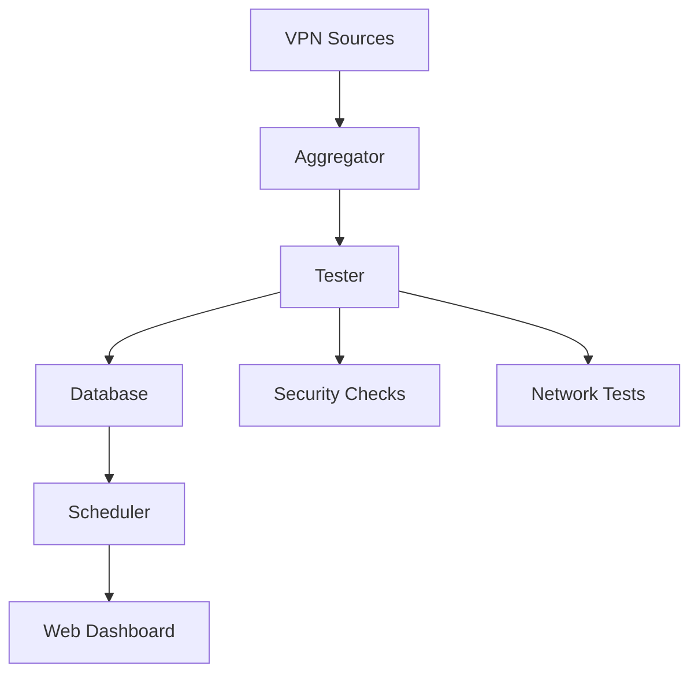

# ConfigStream

**Advanced VPN Configuration Aggregator & Monitoring System**

ConfigStream is a comprehensive solution for aggregating, testing, and monitoring VPN configurations with automated testing cycles, real-time dashboards, and historical performance tracking.

## Features

### 🔄 Automated Testing
- Runs tests every 2 hours automatically
- Comprehensive network quality testing
- Bandwidth measurement
- Packet loss and jitter analysis

### 📊 Real-Time Dashboard
- Beautiful web interface
- Live statistics and charts
- Advanced filtering capabilities
- Export to CSV/JSON

### 🔐 Security Checks
- IP reputation verification
- Certificate validation
- Tor/proxy detection
- Blocklist checking

### 📈 Historical Tracking
- Performance history database
- Reliability scoring
- Trend analysis
- Uptime monitoring

### 🎯 Advanced Features
- Plugin system for extensibility
- Interactive TUI
- Prometheus metrics export
- Kubernetes deployment ready

## Quick Start

### Installation

```bash
# Using pip
pip install configstream

# From source
git clone https://github.com/amirrezafarnamtaheri/configstream
cd configstream
pip install -e .
```

### Basic Usage

```bash
# Start the daemon with web interface
configstream daemon --interval 2 --port 8080

# Run one-time test
configstream test --input configs.txt

# Merge and test configurations
configstream merge --sources sources.txt --output merged.txt
```

### Access the Dashboard

After starting the daemon, open your browser to:

```
http://localhost:8080
```

## Documentation

- [Getting Started Guide](getting-started)
- [Configuration Reference](configuration)
- [API Documentation](api)
- [Examples & Tutorials](examples)
- [Deployment Guide](deployment)

## Architecture



## Performance

- Tests 1000+ VPN configurations in < 5 minutes
- Real-time dashboard with 2-minute refresh
- Stores unlimited historical data
- Handles concurrent testing efficiently

## Contributing

We welcome contributions! See our [Contributing Guide](contributing) for details.

## License

MIT License - see [LICENSE](https://github.com/amirrezafarnamtaheri/configstream/blob/main/LICENSE)

## Support

- [GitHub Issues](https://github.com/amirrezafarnamtaheri/configstream/issues)
- [Discussions](https://github.com/amirrezafarnamtaheri/configstream/discussions)
- [Documentation](https://amirrezafarnamtaheri.github.io/configstream)