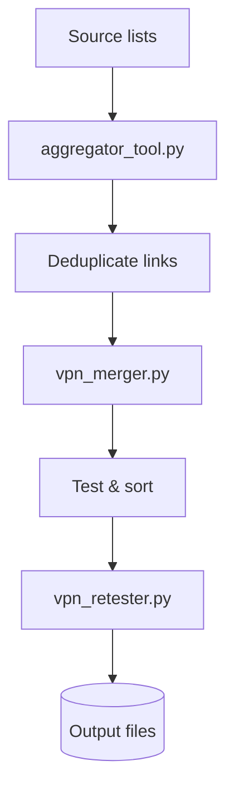

## 🏁 Zero-to-Hero Walkthrough

1. **Clone the repository:**
   ```bash
   git clone https://github.com/AmirrezaFarnamTaheri/MassConfigMerger.git
   cd MassConfigMerger
   ```
2. **Install the requirements:**
   ```bash
   pip install -r requirements.txt
   # optional: install the package for CLI commands
   pip install -e .
   ```
   Installing from PyPI works too (`pip install massconfigmerger`) and provides the `aggregator-tool`, `vpn-merger` and `vpn-retester` commands.
3. **Run `massconfigmerger fetch`** to grab fresh configuration links:
   ```bash
   massconfigmerger fetch --hours 12
   # or
   aggregator-tool --hours 12
   # or
   python aggregator_tool.py --hours 12
   ```
4. **Run `massconfigmerger merge`** to test and merge all configs:
   ```bash
   massconfigmerger merge
   # or
   vpn-merger
   # or
   python vpn_merger.py
   ```
   Example output showing the new cumulative progress bar:
   ```
   🔄 [2/6] Fetching configs from 120 available sources...
   Testing: 50/120 cfg
   ```
5. **Retest existing results** anytime with `massconfigmerger retest`:
   ```bash
   massconfigmerger retest
   # or
   vpn-retester
   # or
   python vpn_retester.py
   ```
6. Import the files in `output/` into your VPN client or share the base64 link.

## Data Pipeline Overview


The pipeline works as follows:
1. `aggregator_tool.py` collects subscription URLs from `sources.txt` and `channels.txt`.
2. Duplicate links are removed so each configuration is processed only once.
3. `vpn_merger.py` downloads every config, tests connectivity and orders the servers by speed.
4. `vpn_retester.py` can optionally re-check a previous run for up-to-date latency.
5. All cleaned and sorted files are written to the `output/` folder, ready to import into your VPN client.


### 🐳 Docker

Build the image and run the merger without installing Python locally:

```bash
docker build -t vpn-merger .
docker run --rm vpn-merger
```

### Docker Compose

You can also run the merger on a schedule with Docker Compose. Build the image
and start the service:

```bash
docker compose build
docker compose up -d
```

By default the `vpn_merger` service runs once a day. Start the optional
`aggregator` service with:

```bash
docker compose --profile aggregator up -d
```
To periodically retest existing results, start `vpn_retester` as well:

```bash
docker compose --profile retester up -d
```

Adjust `MERGE_INTERVAL` (default `86400`) and `AGGREGATE_INTERVAL` (default
`43200`) in `docker-compose.yml` to change how frequently each script runs.

### Docker Compose / Local Scheduling

Use the included `docker-compose.yml` if you want the merger to run
automatically on your own machine. It builds the Docker image and repeatedly
executes `vpn_merger.py`, storing results in the `output/` directory that is
mounted to your host.

Start it with:

```bash
docker compose up -d
```

The container runs the script once a day by default. Set `MERGE_INTERVAL` and
`AGGREGATE_INTERVAL` in `docker-compose.yml` to change how often the merger and
aggregator run.

## ✨ Key Features & Use Cases

| Feature | Description | Typical Use Case |
| ------- | ----------- | ---------------- |
| **Huge Source List** | `sources.txt` includes over 470 public subscription sources and is shared by all tools. | Get a massive selection of servers with a single command. |
| **Availability Testing** | Checks each source before downloading. | Skip dead links and save time. |
| **Connectivity Testing** | Optional TCP checks measure real latency. | Prioritize servers that actually respond. |
| **Smart Sorting** | Orders the final list by reachability and speed. | Quickly pick the best server in your VPN client. |
| **Batch Saving** | Periodically saves intermediate results with `--save-every` (default `100`). | Useful on unreliable connections. |
| **Graceful Interrupt** | Hit `Ctrl+C` to stop early and write any collected configs. | Safe exit without losing progress. |
| **Protocol Filtering** | Use `--include-protocols` or `--exclude-protocols` to filter by protocol (defaults to the Hiddify list). | Keep only the protocols your client supports. |
| **Country Filtering** | Use `--include-country` or `--exclude-country` with a GeoIP database to select specific regions. | Limit servers to preferred countries. |
| **TLS Fragment / Top N** | Use `--tls-fragment` or `--top-n` to trim the output. | Obscure SNI or keep only the fastest N entries. |
| **MUX/SMUX Tuning** | `--mux` and `--smux` modify connection multiplexing. | Improve throughput with modern clients. |
| **Resume from File** | `--resume` loads a previous raw/base64 output before fetching. | Continue a crashed run without starting over. |
| **Custom Output Dir** | Use `--output-dir` to choose where files are saved. | Organize results anywhere you like. |
| **Set Test Timeout** | Tune connection checks with `--test-timeout`. | Useful for slow or distant servers. |
| **Disable Features** | Flags `--no-url-test`, `--no-sort`, `--no-base64` and `--no-csv` give full control. | Skip slow checks or extra files when not needed. |
| **Max Ping Filter** | Remove configs with latency above `--max-ping` ms. | Keep only fast servers for gaming or streaming. |
| **Concurrent Limit / Retries** | Tweak network load with `--concurrent-limit` and `--max-retries`. | Prevent crashes on slow networks or strict hosts. |
| **Logging to File** | Save all output to a file with `--log-file`. | Useful for headless servers or debugging. |
| **Standalone or Cumulative Batches** | Use `--cumulative-batches` to keep growing files, otherwise each batch only contains new configs. | Flexible automation for heavy runs. |
| **Strict Split** | Batches are strictly capped at `--save-every` by default. Add `--no-strict-batch` to simply trigger on size. | Control how incremental files are produced. |
| **Shuffle Sources** | `--shuffle-sources` randomizes the source order. | Helpful when using `--stop-after-found` to avoid bias. |
| **Sing-box JSON Output** | Every batch also produces `vpn_singbox.json`. | Import directly into modern clients like sing-box/Stash. |
| **Clash YAML Output** | Generate `clash.yaml` (or `batch_*clash.yaml`) for Clash/Clash Meta users. | Works with any client supporting Clash configs. |
| **Hiddify Optimised** | Default protocols match the Hiddify client. | Other clients may reject some entries. |

### 🔍 Feature Breakdown

**Huge Source List**

> The `sources.txt` file covers hundreds of GitHub projects, Telegram channels and personal blogs. Instead of hunting for URLs yourself, you get a curated list that is updated regularly. Perfect when you need a one-click way to access lots of servers.

**Availability Testing**

> Before any downloads happen, the script checks every URL to see if it is still alive. Dead links are skipped so you don't waste time waiting on missing content.

**Connectivity Testing**

> Optionally, the script opens a real TCP connection to each server and measures the latency. This ensures the final list contains servers that actually respond and are fast enough for browsing or streaming.

**Smart Sorting**

> Configurations are sorted with reachable and low-latency servers first. Your VPN client will show the best options at the top so you can connect quickly.

**Batch Saving**

> With `--save-every` (default `100`) you can periodically save progress. Useful on unstable networks; if the run stops, resume with `--resume` and only new servers will be fetched.

**Protocol Filtering**

> Use `--include-protocols` or `--exclude-protocols` to keep only certain technologies (e.g. just Reality) or remove unwanted ones (like Shadowsocks). By default the scripts remove any config detected as `Other`. Combine with `--tls-fragment` or `--top-n` for even finer control.

**Country Filtering**

> Use `--include-country` or `--exclude-country` together with `--geoip-db` to limit servers to specific countries.

**Resume from File**

> If the process is interrupted, run again with `--resume path/to/old_output.txt` and previous results will be loaded before new sources are scanned.

**Custom Output Dir / Test Timeout / Disable Features**

> Tailor where files are saved, how long connection tests run and whether optional steps (like base64 or CSV output) run at all. These switches allow the script to fit many different environments, from low-power devices to cloud servers.

**Max Ping Filter**

> With `--max-ping` you can drop any server that responds slower than a certain number of milliseconds. Perfect for gaming or streaming when only low latency will do.

**Concurrent Limit / Retries**

> The `--concurrent-limit` and `--max-retries` options control how many requests run in parallel and how many times each download is retried. Lower the numbers on unstable networks to avoid crashes.

**Logging to File**

> Use `--log-file myrun.log` to save all console output to a file for later review. Helpful when running the script unattended on a server.

## 🔬 Deep Dive

The script automates a simple but powerful process to create the best possible subscription link from public sources:

1.  **📰 Gathers Sources**: It reads `sources.txt`, which contains over 470 public links where VPN configurations are shared.
2.  **✅ Tests Source Availability**: It quickly checks each of these links to see which ones are currently online and accessible.
3.  **📥 Fetches All Configs**: It visits every active link and downloads all the individual VPN server configurations (`VLESS://`, `VMess://`, etc.).
4.  **⚡ Tests Server Performance**: This is the key step. It attempts a direct connection to each individual server to measure its real-world connection speed (latency/ping). Servers that are offline or too slow are discarded.
5.  **🧹 Cleans and Sorts**: Finally, it removes any duplicate servers and sorts the remaining, working servers from **fastest to slowest**.
6.  **📦 Generates Outputs**: It saves this final, sorted list into multiple formats, including the `base64` subscription file that you use in your app.
7.  **📁 Optional Batch Saving**: With `--save-every` (default `100`), the script periodically saves intermediate results while it runs.

-----

## 🛡️ Important Security & Privacy Disclaimer

**Please read this carefully.**

  * **These are public servers.** The VPN configurations are sourced from public channels. You should assume that the server operators are **unknown and untrusted**.
  * **Do NOT use for sensitive data.** Do not log into banking sites, handle personal emails, or transmit any sensitive information while connected to these servers. Your traffic may not be private.
  * **For general-purpose use only.** This service is excellent for general Browse, bypassing geo-restrictions, and accessing blocked content. It is **not** a replacement for a reputable, paid VPN service if you require high security and privacy.
  * **You are using this at your own risk.** The creators of this script are not responsible for how you use these servers.

-----

## 🛠️ How to Get Your Subscription Link (Choose One Method)

### Method 1: Fully Automated with GitHub Actions (Recommended)

This is the best method. You will create a personal copy (a "fork") of this repository, and GitHub's servers will automatically run the script for you every 6 hours. This gives you a personal, auto-updating subscription link.

**Step 1: Fork the Repository**

1.  Make sure you are logged into your GitHub account.
2.  Go to the top of this repository's page.
3.  Click the **`Fork`** button. A "fork" is simply your own personal copy of a project.
4.  On the "Create a new fork" page, you can leave all the settings as they are and just click the green **`Create fork`** button.

**Step 2: Enable Workflows in Your Fork**

1.  After forking, you will be on the main page of *your* new repository. Click on the **`Actions`** tab.
2.  GitHub disables workflows on forks by default for security. You will see a yellow banner. Click the green button that says **`I understand my workflows, go ahead and enable them`**.

**Step 3: Run the Workflow for the First Time**

1.  In the left sidebar, click on the workflow named **`Merge VPN Subscriptions`** (defined in `.github/workflows/merge.yml`).
2.  You will see a blue banner that says "This workflow has a `workflow_dispatch` event trigger." Look to the right side of the screen and click the **`Run workflow`** dropdown button.
3.  Leave the settings as they are and click the final green **`Run workflow`** button.
4.  The script will now start running on GitHub's servers. Wait about 3-5 minutes for it to complete. You can click on the run to see its progress.

**Step 4: Get Your Personal, Permanent Subscription Link**

1.  Once the workflow is complete (it will have a green checkmark ✓), go back to the main page of your repository (the **`< > Code`** tab).
2.  You will now see a new `output` folder. Click on it.
3.  Click on the file named `vpn_subscription_base64.txt` (if you didn't use `--no-base64`).
4.  On the file view page, click the **`Raw`** button.
5.  **This is your link\!** The URL in your browser's address bar is your permanent, auto-updating subscription link. Copy it. It will look like this:
    `https://raw.githubusercontent.com/YOUR_USERNAME/CleanConfigs-SubMerger/main/output/vpn_subscription_base64.txt`

This workflow runs automatically every day and commits the latest results to the `output/` folder so your link stays updated.

You are now ready to use this link in any VPN app\!

### Method 2: On Your Local Computer

Use this method if you want to run the script on your own machine.

**Step 1: Install Python**
If you don't have it, download from [python.org](https://www.python.org/downloads/).

> **Important**: On Windows, check the box that says "**Add Python to PATH**" during installation.

**Step 2: Download the Project**

1.  Click the green **`< > Code`** button on this page -\> **`Download ZIP`**.
2.  Extract the ZIP file to a folder on your computer.

**Step 3: Install Dependencies**

1.  Open a terminal (or `cmd` on Windows).
2.  Navigate to the project folder: `cd path/to/your/folder`.
3.  Run: `pip install -r requirements.txt`.
      * *Troubleshooting*: If you get a "permission denied" error, try `sudo pip install -r requirements.txt` on macOS/Linux, or right-click `cmd` and "Run as administrator" on Windows.

**Step 4: Run the Script**
In the same terminal, run:

```bash
python vpn_merger.py
```

After 5-15 minutes, the `output` folder will appear with your files. To use the output, upload the content of `vpn_subscription_base64.txt` (if created) somewhere (like a private [GitHub Gist](https://gist.github.com/)) and use that file's "Raw" URL.

### Method 3: Using Google Colab (Easy, No Setup)

1.  Go to [colab.research.google.com](https://colab.research.google.com) and click **`File`** -\> **`New notebook`**.
2.  Copy the entire code from the `vpn_merger.py` file in this repository.
3.  Paste it into the Colab cell and click the "Play" button (▶️).
4.  When it finishes, find the `output` folder in the file explorer on the left. Right-click the files to download them. (Like Method 2, you'll need to host the `base64.txt` file's content to get a usable link).

-----

## 📲 How to Use Your Link in VPN Apps

Here’s how to add your new subscription link to the best **free** applications.

### 🖥️ Windows & Linux

#### **App: NekoRay / NekoBox**

  * **About**: A powerful and popular client for Windows and Linux.
  * **Download**: Get it from the [NekoRay GitHub Releases](https://github.com/MatsuriDayo/nekoray/releases).

**Instructions:**

1.  Open NekoRay.
2.  From the top menu, go to **`Program`** -\> **`Add profile from URL`**.
3.  Paste your subscription link into the **`URL`** field and give it a name in the **`Name`** field.
4.  Click **`OK`**.
5.  In the main window, right-click on the new subscription group and select **`Update`**.
6.  Select a server from the list and press `Enter` to set it as active.
7.  To route your system's traffic, go to the top menu, select **`TUN Mode`**, and make sure it is checked.

### 📱 Android

#### **App 1: v2rayNG (Recommended for Beginners)**

  * **About**: The most widely used and stable V2Ray client for Android.
  * **Download**: Get it from the [Google Play Store](https://www.google.com/search?q=https://play.google.com/store/apps/details%3Fid%3Dcom.v2ray.ang) or [GitHub Releases](https://github.com/2dust/v2rayNG/releases).

**Instructions:**

1.  Open v2rayNG.
2.  Tap the **`☰`** menu icon (top-left).
3.  Select **`Subscription group setting`**.
4.  Tap the **`+`** icon (top-right).
5.  Give it a name in the **`Remark`** field (e.g., "Ultimate").
6.  Paste your subscription link into the **`URL`** field.
7.  Tap the checkmark (**`✓`**) to save.
8.  Back on the main screen, tap the three-dots menu (**`⋮`**) and select **`Update subscriptions`**.
9.  After it updates, you can run a real-world speed test by tapping the three-dots menu (**`⋮`**) -\> **`Test all configurations (real delay)`**.
10. Tap a server with good speed, then tap the large **`V`** icon at the bottom to connect.

#### **App 2: NekoBox for Android**

  * **About**: A modern client with a beautiful interface, supporting multiple protocols.
  * **Download**: Get it from [GitHub Releases](https://github.com/MatsuriDayo/NekoBoxForAndroid/releases).

**Instructions:**

1.  Open NekoBox and tap the **`Profiles`** tab at the bottom.
2.  Tap the **`+`** icon (top-right), then select **`Add subscription`**.
3.  Give the profile a name.
4.  Paste your subscription link into the **`Subscription URL`** field.
5.  Tap **`OK`**.
6.  Go back to the **`Dashboard`** tab. You'll see your new group. Tap it to select a server.
7.  Tap the floating "Connect" button in the bottom-right to connect.

### 🍎 macOS & iOS (iPhone/iPad)

#### **App: Hiddify-Next (Recommended Cross-Platform Client)**

  * **About**: A fantastic, modern, and open-source client that works on nearly every platform.
  * **Download**: Find it on the [App Store](https://www.google.com/search?q=https://apps.apple.com/us/app/hiddify-next/id6444434822) for iOS/macOS or from [GitHub](https://github.com/hiddify/hiddify-next/releases).

**Instructions (same for macOS and iOS):**

1.  Open Hiddify-Next.
2.  Tap the large **`+`** button on the main screen.
3.  Select **`Add from URL`**.
4.  Paste your subscription link into the field.
5.  Tap **`Continue`**. The app will import the profile.
6.  Select the new profile from the list.
7.  Tap the large "Connect" slider to turn it on. The app will automatically test and select the best server for you.

-----

### 🏁 Alternative Clients

There are many other applications that can import the generated subscription. Below are a few noteworthy ones:

* **Shadowrocket** (iOS)
  * **Pros**: Extremely feature rich with fine‑grained routing rules.
  * **Cons**: Paid app and only available on the App Store.
  * **Best Use**: Power users on iPhone/iPad who want maximum control.

* **Clash Meta** (Windows/macOS/Linux)
  * **Pros**: Supports a huge range of protocols and advanced rule based routing.
  * **Cons**: Configuration files can be complicated for beginners.
  * **Best Use**: Desktop users who need custom routing by domain or IP.

* **Stash** (iOS/macOS)
  * **Pros**: Built on the sing-box core with a polished interface.
  * **Cons**: Some features require a purchase.
  * **Best Use**: Users who want sing-box features on Apple devices.

* **Leaf** (macOS)
  * **Pros**: Simple GUI front‑end for Clash. Easy to get started.
  * **Cons**: Less customisation than editing Clash configs directly.
  * **Best Use**: Mac users who prefer a small native app.

Each client has its own strengths, so choose the one that fits your platform and skill level.

Users of **Clash** or **Clash Meta** can import the provided `clash.yaml` for a ready-to-use proxy list.

#### Example: import YAML into Clash Meta
1. Open **Clash Meta** and go to **Profiles**.
2. Click **Import** and select the path or URL to `vpn_clash_proxies.yaml`.
3. Enable the new profile to see all proxies.

-----

